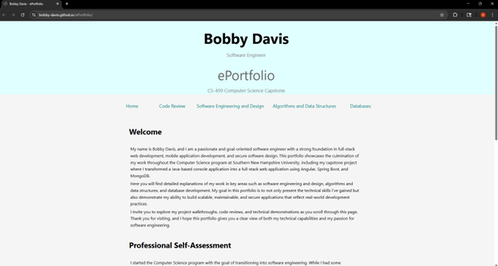

# CS 499 Enhancement Plan and Skill Reflection


I have been in the Computer Science program at SNHU since October 2023  
Throughout the program I think I’ve gained a strong foundation in building and understanding real-world software systems. I learned how to use object-oriented programming to write clear, reusable code, how to manage data using SQL and NoSQL databases, and how to build full stack applications. I also practiced creating mobile apps, using GitHub for version control, and applying basic security and testing practices.

The three most important concepts I’ve learned:

* **Object-Oriented Programming (OOP):** Understanding how to organize code using classes, inheritance, and encapsulation helped me write programs that are easier to maintain and expand

* **Full-Stack Development:** Learning how to connect frontend and backend systems to work together using APIs and databases prepared me to build complete professional applications

* **Version Control with Git/GitHub:** Being able to track code changes, collaborate on projects, and manage repositories is a skill I will use in most software development jobs.


I plan to demonstrate several important skills by turning my original console-based rescue animal program into a modern full stack web application. I will build a user-friendly interface using Angular, create a secure backend using Java with Spring Boot and use MongoDB to store animal records. This means the app will look and work more like something used in the real world.  

I plan to become a software engineer after graduating and I feel that knowing how to build a full-stack application is extremely valuable in the industry. Building a full-stack application from the ground up demonstrates that I can handle both frontend and backend development, which is something that is valuable especially in smaller teams where developers are expected to be flexible. By organizing my code with MVC patterns and RESTful API’s, I show that I can create clean and organized code that is easy for others to read which will show that I can work in a collaborative environment. I also decided to use Spring Boot because it aligns with the technology stack used by the company I currently work for and learning it now will help me to prepare for a future transition into a software engineering role.  

This project helps me to focus on full-stack development, which is the area that I want to specialize in as a software engineer. By building both the frontend and backend I’m gaining more hands-on experience. It also shows employers that I can design, complete systems, manage data, build secure API’s and create user-friendly interfaces.  


---

## I. Enhancement Plan:  

### Category One: Software Engineering and Design  

The artifact I selected is the Rescue Animal Management System that was originally developed in the IT-145 Foundations in Application Development course. It is one of the first courses I took when starting at SNHU. The project was very simple and helped to understand object-oriented programming. It is a Java console-based program that manages rescue dogs and monkeys.  

I will transform this console-based Java application into a full-stack web application using Spring Boot for the backend and Angular for the front end. This plan will involve refactoring the code into a RESTful API (Controller, Service, Repository layers), replacing console-based inputs with user-friendly UI, and creating endpoints for CRUD operations (create, read, update, delete) on animal records. There will be an addition of login/authentication with a username/password. Input will also be validated to avoid bad requests. 

#### Frontend
```text
User navigates to Animal Dashboard
  Clicks “See Our Rescue Animals”
    Send GET request to /api/animals
      Display animal list with paginated results
        Add button appears for admin
        Each animal card has buttons: Edit / Delete
          Click “Edit” -> Load Edit Animal form with existing data
            On Submit: Confirm -> PUT /api/animals/{id} with updated data
          Click “Delete” -> On Confirm: DELETE /api/animals/{id}
        Click “Add Animal” -> Opens new Animal form
          On Submit: Confirm -> POST /api/animals with form data
```
#### Backend
```text
AnimalController:
    POST /api/animals -> addAnimal()
    GET /api/animals -> getAllAnimals()
    GET /api/animals/{id} -> getAnimalById()
    PUT /api/animals/{id} -> updateAnimal()
    DELETE /api/animals/{id} -> deleteAnimal()
```


**How planned enhancement will demonstrate specific skills and align with course outcomes:**  

* **Separation of Concerns (MVC Pattern):** dividing the app into layers (controller, service, repository) shows that I can organize code. This improves readability and makes it easier for teams to work together (outcome 1)  
* **Using modern tools (Spring Boot & Angular):** these are tools used by developers currently. By using them in my enhancements, I’m showing that I can build industry standard applications (outcome 4)  
* **RESTful API:** Creating clean, consistent APIs helps frontend and backend teams work well together. It also shows I can build systems that integrate easily with others. (outcome 2)  
* **Frontend UI enhancements:** moving from command-line to a web app with forms and confirmations, I’m improving user experience, which makes the app more accessible (outcome 2)  
* **Security Practices:** Adding route protection and input validation on forms show that I think of security when coding. (outcome 5)  

**Course outcomes that enhancement will align with:**  
1. Employ strategies for building collaborative environments that enable diverse audiences to support organizational decision-making in the field of computer science.  
2. Design, develop, and deliver professional-quality oral, written, and visual communications that are coherent, technically sound, and appropriately adapted to specific audiences and contexts.  
4. Demonstrate an ability to use well-founded and innovative techniques, skills, and tools in computing practices for the purpose of implementing computer solutions that deliver value and accomplish industry-specific goals.  
5. Develop a security mindset that anticipates adversarial exploits in software architecture and designs to expose potential vulnerabilities, mitigate design flaws, and ensure privacy and enhanced security of data and resources.  

---

### Category Two: Algorithms and Data Structures  

I am using the same artifact as before from IT-145. The Rescue Animal Project. Originally, animal data was stored in in-memory ArrayLists, and search was handled by linear iteration (O(n)).  

I plan to improve how animal data is searched by replacing the current manual approach with more efficient queries using MongoDB’s indexing features. In the original version of the program, searching through animal data meant checking each record one by one using a for-loop, which becomes slower as the number of records grow. By using MongoDB’s build in indexing and query capabilities, I can search more quickly and reduce how much work the program does. This will help the program run faster, especially as the dataset gets larger.  

```text
Function searchAnimals(filters):
    Create empty MongoDB query object

    If filters.type exists:
        Add { type: filters.type } to query

    If filters.trainingStatus is "in service" AND filters.available is true:
        Add { reserved: false, trainingStatus: "in service" } to query

    If filters.size exists:
        Add { size: filters.size } to query

    If filters.ageMin or ageMax exists:
        Add { age: { $gte: filters.ageMin, $lte: filters.ageMax } } to query

    Execute MongoDB find(query)
    If sort option exists:
        Apply sort (e.g., by name, age, or size)

    Paginate results:
        Skip (page - 1) * limit
        Limit to `limit` results per page

    Return results to frontend
```


**How planned enhancement will demonstrate specific skills and align with course outcomes:**  

• Instead of looping through every animal record manually, I’ll use database queries that are built to find results faster. This helps make the search process quicker and more efficient, especially when there are a lot of records. I’ll also make it easier to narrow results using filters to break them into smaller pages.  
• The original version used a basic loop, which gets slower as more data is added (O(n) time). By using MongoDB with indexes, searches can be done much faster (closer to O(logn)).  

**Course outcomes that enhancement will align with:**  
3. Design and evaluate computing solutions that solve a given problem using algorithmic principles and computer science practices and standards appropriate to its solution while managing the trade-offs involved in design choices.  
4. Demonstrate an ability to use well-founded and innovative techniques, skills, and tools in computing practices for the purpose of implementing computer solutions that deliver value and accomplish industry-specific goals.  

---

### Category Three: Databases  

I will continue to use the same artifact from IT-145. In the original project, animal records were stored in-memory using java ArrayLists. Data was lost every time the application was closed, which isn’t very practical.  

To make sure the animal records aren’t lost when the application closes, I will add MongoDB as the database system. This means the data will be saved permanently and can be accessed any time the app runs. I’ll set up separate collections in MongoDB for dogs and monkeys to keep the data organized. I’ll use Spring Data MongoDB to create simple methods that let the app add, update, find or delete animal records.  

```text
When user submits Add or Update form:
    Validate form input
    If new entry:
        Call POST /api/animals
        Save Animal record in MongoDB
    Else if editing existing record:
        Call PUT /api/animals/{id}
        Update Animal record in MongoDB

When user clicks delete:
    Show confirmation prompt
    If confirmed:
        Call DELETE /api/animals/{id}
        Remove Animal record from MongoDB

When user opens View Animals screen:
    Call GET /api/animals
    Retrieve all Animal records (or filtered subset)

AnimalRepository extends MongoRepository<Animal, String>

Operations:
    // Create
    save(new Animal(...))

    // Read
    findAll()
    findByTrainingStatusAndReserved("in service", false)
    findByTypeAndSizeAndAgeRange(...) // with filters

    // Update
    Save edited Animal using ID

    // Delete
    Delete Animal by ID
```


**How planned enhancement will demonstrate specific skills and align with course outcomes:**  

• I’ll organize animal data using MongoDB collections  
• I’ll connect the app to MongoDB using Spring Data to perform CRUD operations efficiently  
• I will store animal records permanently instead of in memory, making the app usable beyond a single session  
• I will validate user input before saving it to MongoDB to make sure data is clean, safe, and accurate  
• Show real-world development skills by working with widely used technology like MongoDB and Spring Boot  

**Course outcomes that enhancement will align with:**  
3. Design and evaluate computing solutions that solve a given problem using algorithmic principles and computer science practices and standards appropriate to its solution while managing the trade-offs involved in design choices.  
4. Demonstrate an ability to use well-founded and innovative techniques, skills, and tools in computing practices for the purpose of implementing computer solutions that deliver value and accomplish industry-specific goals.  
5. Develop a security mindset that anticipates adversarial exploits in software architecture and designs to expose potential vulnerabilities, mitigate design flaws, and ensure privacy and enhanced security of data and resources.  

---

## 4. ePortfolio Overall Skill Set  

**Skills and outcomes planned to be illustrated in the code review**  
• Highlight the change from in-memory, console-based application to a professional, full-stack application reflecting real-world standards  
• Show how separating the application into models, views, and controllers improves readability, scalability, and team collaboration  
• Show how RESTful API endpoints are designed and implemented in Spring Boot to manage CRUD operations  
• Display how Spring Data MongoDB is used to connect the application to NoSQL database  

**Skills and outcomes planned to be illustrated in the narratives**  
• The narrative will explain the reasoning behind choosing technologies like Spring Boot, Angular, and MongoDB, showing off the trade-off between flexibility, scalability and simplicity  
• Describe how the MVC pattern and RESTful APIs are used to structure the application in a way that separates concerns and improves maintainability  
• Includes discussion of input validation, protected endpoints, and proper data handling to mitigate risks  
• Communicate how enhancements solve real problems and align with industry standards  

**Skills and outcomes planned to be illustrated in the professional self-assessment**  
• Showing off the growth in integrating frontend, backend, and database layers into a complete application  
• Shows off the ability to plan, enhance and test an application independently  
• Demonstrates the ability to learn and apply new tools outside of prior coursework experience  
• Reflect the shift in academic exercises to building projects that follow real-world practices in software design and development  
• Shows development of time management, attention to detail, and an understanding of how software must meet both technical and user needs  

